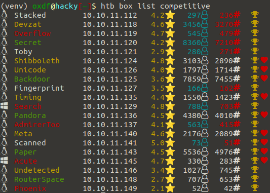

# htbcli
HackTheBox Command Line Tool



# Requirements

## nmcli

VPN is controlled by the `nmcli` program. 

Is installed in most Debian-based Linux distributions by default.

Can be installed with:
```
$ apt-get install network-manager
```

## Fonts

To make the icons print nicely, need a [nerd font](https://www.nerdfonts.com/) installed.

Install instructions (Linux):

```
wget https://github.com/ryanoasis/nerd-fonts/releases/download/v2.1.0/Ubuntu.zip -O /tmp/Ubuntu.zip
mkdir -p ~/.local/share/fonts
unzip /tmp/Ubuntu.zip -d ~/.local/share/fonts
fc-cache -fv
```

# Installation

```bash
pip install PyHTBcli
```

# Shell Auto Complete

To get tab completion in the default linux shell.

## Bash

Add this line to `~/.bashrc`:

```bash
eval "$(_htb_COMPLETE=bash_source htb)"
```

## Zsh

Add this line to `~/.zshrc`:

```bash
eval "$(_HTB_COMPLETE=zsh_source htb)"
```

## Fish

Add this to `~/.config/fish/completions/htb.fish`:

```bash
eval (env _HTB_COMPLETE=fish_source htb)
```

## Full Documention

See [readthedocs](https://pyhtbcli.readthedocs.io/en/latest/) for full documentation.
